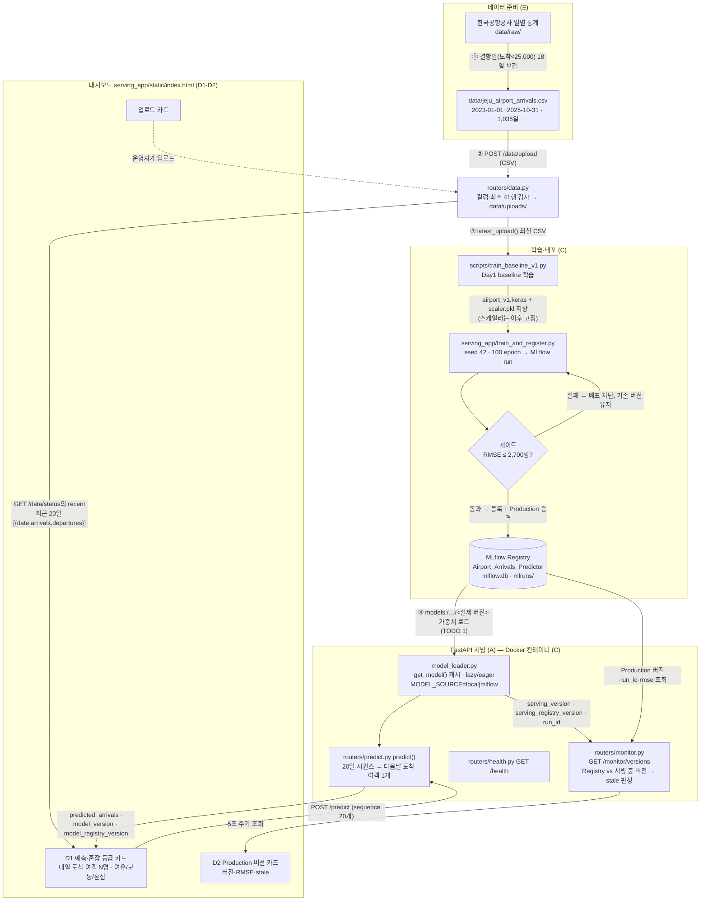
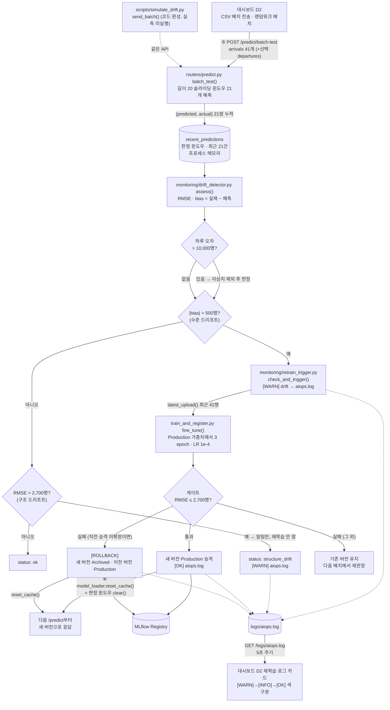

# ④ 아키텍처 구성도

> **생성물.** 코드가 모두 완성된 뒤 프롬프트 4가 `docs/code_current.md`·`docs/IMPLEMENTATION_REPORT.md`·실제 코드에서 생성했다 (2026-10-01, `origin/main` `7364435` 기준). 손으로 고치지 않는다.
> 모든 구성 요소는 실제 코드에서 존재를 확인했다. 계획만 있고 코드에 없는 구성 요소는 없다.

전체 파이프라인은 **업로드 → 학습·게이트·승격 → 서빙 → 드리프트 감지 → 자동 재학습 → 재배포**가 한 바퀴로 이어진다. 한 장에 담으면 복잡해 (1) 데이터·학습·서빙 흐름과 (2) 드리프트 대응(AIOps) 흐름 두 장으로 나눴다. 두 장은 ⑤번 화살표(예측 기록 누적)에서 이어진다.

## 구성도 1 — 데이터·학습·서빙 흐름

- 학습 코드와 서빙 코드는 **MLflow Registry(`models:/Airport_Arrivals_Predictor/Production`)로만 만난다** (`docs/code_current.md` 5번).
- 컨테이너(`serving_app/Dockerfile`, `docker-compose.yml`)는 이미지 빌드 중 baseline + MLflow 학습을 실행하고 `MODEL_SOURCE=mlflow`·`LOADING_MODE=eager`로 기동한다 — 어느 PC에서나 같은 절차로 재현.
- `GET /monitor/versions`는 Registry가 말하는 버전과 서버가 실제로 들고 있는 버전을 나란히 비교해 재배포 후 캐시가 안 비워진 상태(`stale=true`)를 대시보드에서 눈으로 볼 수 있게 한다 — 수업 가이드 부록1의 6번 문제를 화면으로 드러내는 신규 API.

## 구성도 2 — 드리프트 대응(AIOps) 흐름

- 판정은 세 종류다: **이상치**(폭설 결항일 등 하루 오차 > 10,000명 — 제외 후 판정), **수준 드리프트**(|bias| > 500명 — 수요 수준이 바뀜, 재학습), **구조 드리프트**(치우침 없는 큰 오차 — 알림만, 41행 fine-tuning으로 안 줄어든다는 실측 근거). RMSE ≥ |bias|가 항상 성립해 재학습 트리거에 RMSE 항은 없다.
- **롤백**: 승격 뒤 첫 판정이 드리프트이고 그 재학습이 게이트에 실패하면 이전 버전으로 되돌린다. 승격 뒤 드리프트 아닌 윈도우가 한 번 나오면 승격 확정. 승격 기록(`_last_promotion`)은 프로세스 메모리에만 있어 서버 재시작 후에는 롤백 불가(알려진 한계).
- 실측 한 바퀴(`main` 컨테이너): 정상 배치 `ok` → 드리프트 배치 `[WARN] rmse=3490 bias=-587` → `[INFO] retrain triggered` → `[OK] new_rmse=2098 v3`, 감지에서 승격까지 **3.7초** (`docs/code_current.md` 2번).

## 단계별 담당 파일·함수와 주고받는 데이터

| 단계 (구성도 번호) | 담당 파일 · 함수 | 주고받는 데이터 |
|---|---|---|
| ① 데이터 가공 (E) | `scripts/prepare_jeju_data.py` | `data/raw/` 원자료 → 결항일(도착 < 25,000, 18일) 보간 → `data/jeju_airport_arrivals.csv` (Date, Arrivals, Departures) |
| ② CSV 업로드 (C) | `serving_app/routers/data.py` `POST /data/upload` | multipart CSV → 컬럼·최소 41행(SEQ_LEN 20 + WINDOW_SIZE 21) 검사 → `data/uploads/` 저장 |
| ②′ 데이터 상태 조회 (C→D1) | `routers/data.py` `status()` (`GET /data/status`) | 행 수·기간·최소/최대 + `recent`(마지막 20행, 오래된 순, `[{date, arrivals, departures}]` 정수) |
| ③ baseline 학습 (C) | `scripts/train_baseline_v1.py` `main()`, `data/storage.py` `latest_upload()`, `data/features.py` `AirportScaler`·`build_sequences()` | 최신 업로드 CSV → 마지막 20% 검증 RMSE → 게이트 통과 시 `serving_app/models/airport_v1.keras` + `scaler.pkl` (이후 스케일러 고정) |
| ③′ MLflow 학습·승격 (C) | `serving_app/train_and_register.py` `train_and_register()` → `_register_if_gate_passed()` | seed 42·100 epoch 학습 → MLflow run(params·metrics·model) → RMSE ≤ 2,700이면 `Airport_Arrivals_Predictor` 등록 + Production 승격 |
| ④ 모델 로드 (A) | `serving_app/model_loader.py` `get_model()` → `_load_from_local()` / `_load_from_mlflow()` (TODO 1) | `MODEL_SOURCE`에 따라 로컬 `.keras`+`scaler.pkl` 또는 Production 조회 후 `models:/…/<실제 버전>` 가중치 → `LoadedModel(predict_one, version, registry_version, run_id)` 캐시 |
| ④′ 단일 예측 (A→D1) | `serving_app/routers/predict.py` `predict()`, `schemas.py` `PredictRequest` | `sequence` 20일(arrivals·departures ≥ 0 정수, 위반 422) → 스케일 → LSTM → 역스케일 → `predicted_arrivals`, `model_version`, `model_registry_version` |
| ④″ 버전 조회 (C→D2) | `serving_app/routers/monitor.py` `versions()` (`GET /monitor/versions`) | Registry Production(버전·run_id·rmse·created_at) + 서빙 중 모델(`serving_version`·`serving_registry_version`) → `stale`(run_id 우선, `stale_basis`), `registry_error`, `tracking_uri` |
| ⑤ 배치 판정 (B) | `routers/predict.py` `batch_test()` (TODO 3), `monitoring/drift_detector.py` `assess()` (TODO 2) | `arrivals` 41개(+선택 `departures`) → 윈도우 21개 예측 → `recent_predictions` 누적 → RMSE·bias·이상치 → `drift_check.status` 5종 (`ok`/`anomaly`/`structure_drift`/`retrain_triggered`/`rolled_back`) |
| ⑤′ 자동 재학습·롤백 (B→C) | `monitoring/retrain_trigger.py` `check_and_trigger()` (TODO 4) → `train_and_register.py` `fine_tune()` | 최신 업로드 41행 → 3 epoch fine-tuning → 게이트 재검증 → `{"promoted", "rmse", "version"}` / 실패 시 유지 또는 `_rollback()` (Registry 스테이지 전환) |
| ⑥ 재배포 반영 (B→A) | `model_loader.reset_cache()` + 판정 윈도우 `clear()` | 승격·롤백 성공 직후 캐시 비움 → 다음 `/predict`가 새 Production 가중치 로드, `/monitor/versions`의 `stale`도 복귀 |
| 로그 (B→D2) | `aiops` 로거(`main.py` 연결) → `logs/aiops.log` → `routers/logs.py` `GET /logs/{filename}` | `[WARN]`(감지) → `[INFO]`(재학습 시작) → `[OK]`(승격) / `[ROLLBACK]` 줄 → 대시보드 로그 카드 색 구분 표시 |
| 시뮬레이션 (B, 보조) | `scripts/simulate_drift.py` `send_batch()` (TODO 5) | 랜덤워크 41일 → `/predict/batch-test`. 코드 완성, σ(1.2%/3.6%)가 실변동성(7.3~8.4%)보다 낮아 실측 미실행 — 시연은 실데이터 CSV 배치 경로 사용 |

## 대시보드와 신규 API의 위치

- **D1 예측 카드**는 ②′(`recent`)와 ④′(`/predict`) 사이에 붙는다: `recent` 20행을 그대로 `sequence`로 보내 내일 도착 여객과 혼잡 등급(Q1 34,962 미만 여유 / Q3 40,177 초과 혼잡)을 보여준다.
- **D2 배치·로그·버전 카드**는 ⑤(배치 전송)의 입력이자 ④″(`/monitor/versions`)·로그 조회의 출력이다. 재학습이 돌면 `[WARN]→[INFO]→[OK]` 로그와 Production 버전 변화(v1→v2)가 화면에서 이어져 보인다.
- **신규 API `GET /monitor/versions`**(C 신설)는 ④(모델 로드)와 ③′(Registry) 사이의 어긋남을 밖으로 드러내는 관측 지점이다 — 승격이 서버 밖에서 일어나면 `stale=true`로 재기동 필요를 알린다.
